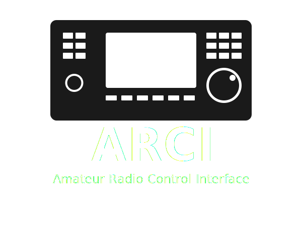

# ARCI (Amateur Radio Control Interface)



What originally started as a big monolithic Arduino project that grew over the years, being naive I decided to try to port it to ESP-IDF back in 2024, which was a huge undertaking.
Rewriting it from scratch would have been easier.. oh hindsight.

2025 consisted of refactoring the codebase, gradually rewriting from the old C / Arduino API to newer C++, and to make the project follow the ESP-IDF component structure.
Lots of scope creep and hardware-related work proceeded throughout 2025. I think I must have squashed and merged 300 to 500 commits? LOTS of rebasing.

Now, enough talk, what is ARCI? It is effectively firmware that emulates a Kenwood TS‑590SG.
ARCI works as a smart CAT command router that provides source‑aware command routing, compatible with most common amateur radio applications, e.g. (N1MM, Hamlib, Omnirig, WSJT-X, HRD, fldigi, etc.).

The ARCI project came about as a means to be able to more easily share the serial port from my radio.
Strictly speaking, it was created to allow me to more easily share the serial port of my RemoteRig box (semantics..).


Problem:

Most serial splitting solutions are software-based, and depending on your use case & setup certain applications can poll the living daylights out of the radio (yes I'm looking at you OmniRig).
To try to reduce the amount of traffic, and ultimately command collision between the radio and the RemoteRig / serial port, I began implementing a cache-based system.
This evolved into what is now a TTL-based caching system, which works pretty darn well.

Each parsed CAT command uses time-based validity. Certain CAT commands have different TTL's.
Both outgoing and incoming commands are timestamped and validated.
It supports up to four concurrent interfaces for CAT control (2x USB CDC, 2x TPC/IP). (This is where the sourced based command routing comes in handy).

## Related Projects

* [ARCI-PCB](https://github.com/stianeklund/ARCI-PCB)
* [RemoteRadioDisplay](https://github.com/stianeklund/RemoteRadioDisplay)
* ARCI-Enclosure (Not yet published)

## Features

- **Multiple Interface Support**: TS‑590SG CAT emulation over USB‑CDC, TCP/IP network, and UART (for external displays, see RemoteRadioDisplay project)
- **Source‑aware routing**: USB/TCP/Display↔Radio
- **Quad Interface**: Radio UART, USB‑CDC, TCP network, and Display UART2 with zero‑heap
- **Cache System**: TTL-based query caching reduces radio traffic by serving fresh data from cache
- **Independent AI Modes**: Each interface (USB CDC0/CDC1, Tcp0/Tcp1, Display) maintains separate AI mode settings
- **Hardware Controls**: Rotary encoder, buttons, and ADC inputs
- **Direct Architecture**: Improved performance and maintainability

## Architecture Overview

```
USB/TCP/Display/Radio → main.cpp → RadioManager.getCATHandler()
    ↓
CATHandler → CatParser → CommandDispatcher → SpecializedHandlers
    ↓
RadioManager (state + I/O + cache)
    ↓
USB/TCP/Display/Radio responses (source-aware routing)
```

**Key Components:**
- **RadioManager**: Central component owning CommandDispatcher and CATHandlers
- **ButtonHandler**: Uses RadioManager directly for button operations
- **EncoderHandler**: Uses RadioManager directly for frequency tuning
- **ADCHandler**: Uses RadioManager directly for gain/control updates

## Hardware

- ESP32‑S3: see my custom PCB design [ARCI-PCB](https://github.com/stianeklund/ARCI-PCB)
- Kenwood TS‑590SG (could technically support other command sets)
- Rotary encoder, buttons, potentiometers.

## Advanced Features

- **Event-Driven State Sync**: No internal polling; state updates come from radio AI modes, client queries, and auto-readback after SET commands
- **External Display Support**: Complete TS-590SG emulation via UART2 for displays/controllers
- **TTL-Based Cache System**: Reduces radio traffic by serving cached responses when data is fresh
- **Unified Command Processing**: Both USB and Display use identical CAT command pipeline

## Display Interface (UART2)

See: [RemoteRadioDisplay](https://github.com/stianeklund/RemoteRadioDisplay)

The firmware provides a complete virtual TS-590SG interface on UART2 for external displays:

**Features:**
- **Complete CAT Compatibility**: All TS-590SG commands work identically to USB interface
- **Cached Responses**: Frequency, mode, and status queries return cached data when fresh
- **Real-time Updates**: Radio responses automatically forwarded to display
- **Smart Filtering**: Frequency updates suppressed during tuning to prevent flicker
- **Bidirectional Control**: Display can query AND control radio functions

**Use Cases:**
- External frequency displays with S-meter
- Remote control interfaces
- Logging applications
- Custom display projects

**Connection**: Standard 3.3V UART (9600-115200 baud, configurable)

## Network Interface (TCP)

The firmware provides CAT control over TCP/IP for network-based applications:

**Features:**
- **Complete CAT Compatibility**: All TS-590SG commands work identically to USB interface
- **Hamlib/rigctld Support**: Works with hamlib, flrig, WSJT-X, and other network CAT apps
- **Dual TCP Ports**: Independent Tcp0 (port 5001) and Tcp1 (port 5002) interfaces
- **Independent AI Modes**: Each TCP port maintains separate AI mode settings
- **Cached Responses**: Same TTL-based caching as USB for fast query responses
- **Single Client Enforcement**: One client per port (new connections replace old)
- **Strict Query-Answer Pairing**: Radio answers routed back to originating TCP client only

**Configuration:**
- **Port 7373**: Primary TCP interface (Tcp0)
- **Port 7474**: Secondary TCP interface (Tcp1, optional)
- Configure via `idf.py menuconfig` → TCP CDC Bridge Options
- Default: Enabled, configurable ports and buffer sizes

**Example Connection (Hamlib):**
```bash
# Direct connection to radio via TCP
rigctl -m 2014 -r localhost:7373

# Start rigctld daemon
rigctld -m 2014 -r localhost:7373 -t 4532
```

## Configuration

Use `idf.py menuconfig` to access RadioCore Options:

### Cache & State Sync
- **Auto-readback after SET**: After a local SET command (USB/Panel), the dispatcher sends the corresponding READ to the radio to confirm state. Suppressed automatically in AI2/AI4 modes where the radio broadcasts changes, and during active encoder tuning to prevent race conditions.
- **TTL-based cache**: Query responses are served from cache when fresh, with per-command TTL categories:
  - Real-time (500 ms): Meters and frequencies
  - Status (5 s): Status commands that change moderately
  - Static Config (30 s): Configuration commands that rarely change
- **No internal polling**: State sync relies on radio AI mode updates, client queries, and auto-readback

## Getting Started

1) Set up ESP‑IDF environment.
2) Wire hardware per your pin definitions.
3) Configure via menuconfig (optional):
   ```bash
   idf.py menuconfig
   ```
4) Build/flash and monitor:
   ```bash
   idf.py build
   idf.py flash monitor
   ```

## Tests

Unity tests cover parser + dispatcher + handlers, enable unity tests via menuconfig & build flash monitor.
Key areas: handler routing (no overlap), Local vs. Remote behavior, RadioState updates.

## Usage

Connect the USB‑CDC port to your PC CAT application. 
The firmware forwards Set/Read to the radio and returns Answer frames to the PC, updating internal state along the way.

## Documentation

- `docs/ARCHITECTURE.md`: Quick Memory of the command‑based system and component locations.
- `docs/WIRING_DIAGRAM.md`: Hardware wiring reference.


## Known Issues & Dependencies

### esp_websocket_client Version Constraint

The `esp_websocket_client` component is pinned to `~1.2.0` in `main/idf_component.yml` due to ESP-IDF 5.5 compatibility:

- **Issue**: `esp_websocket_client` v1.6.0+ requires `esp_transport_ws_get_redir_uri()` which was added to ESP-IDF's `tcp_transport` component *after* v5.5.
- **Symptom**: Build fails with `implicit declaration of function 'esp_transport_ws_get_redir_uri'`
- **Fix**: Pin to `~1.2.0` (resolves to 1.2.3) which doesn't use the redirect URI feature.
- **Future**: When upgrading to ESP-IDF 5.6+, the constraint can be relaxed to `*` to use the latest version.

The redirect URI feature (HTTP 301/302/307/308 handling during WebSocket handshake) is not needed for direct server connections.

## License

GNU General Public License v3.0 or later
